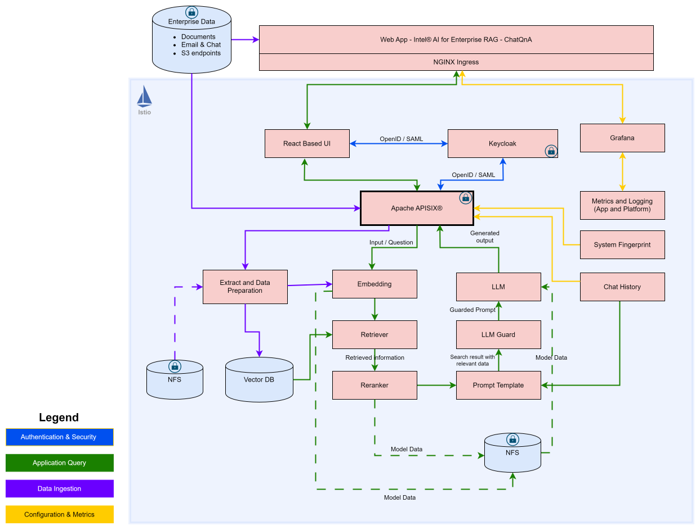
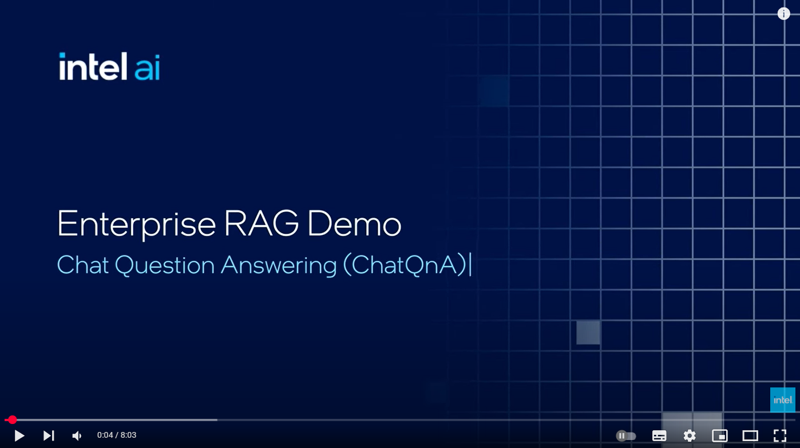

# Intel® AI for Enterprise RAG

[](LICENSE)
[](https://github.com/intel/enterprise-ai-solutions)
[](https://www.intel.com/xeon)
[](docs/deploy/pipelines.md)
[](https://www.keycloak.org)

**Enterprise-grade retrieval-augmented generation layer for Intel® AI for Enterprise Solutions. Turn your enterprise documents into a governed, production-ready AI assistant on Intel® Xeon® CPUs.**

> Ships the Ansible roles, Helm charts, and composable pipeline definitions that deploy a full RAG application - document ingestion, vector search, reranking, guardrails, chat history, and a web UI - wired into the platform's identity, gateway, storage, and observability.

> [!IMPORTANT]
> **This repository is not used standalone.** It is a component of the
> [**ai-solutions**](https://github.com/intel/enterprise-ai-solutions)
> platform and is automatically cloned into it at `enterprise-ai-solutions/ext/enterprise.ai-erag/`, where it contributes the
> **`erag`** layer. Install the platform first - it provisions the Kubernetes cluster,
> the platform services (cert-manager, Istio, MetalLB, Envoy Gateway, PostgreSQL, Keycloak,
> MinIO, observability), and the model serving this layer consumes.
> Every command below runs from the **solutions repo root**, not from here.

---

## What is Intel® AI for Enterprise RAG?

Intel® AI for Enterprise RAG deploys that whole path as one opt-in layer. You pick a pipeline flavour, run two commands, and get a working assistant grounded in your own documents - no model training or fine-tuning required.

Pipelines are composed, not hardcoded. A flavour declares an ordered flow of steps, the composer renders it into a `GMConnector` resource, and the GMC operator reconciles the microservices behind it. Swapping a retrieval strategy or adding output guardrails is a config change, not a rewrite.

> Want the full picture? See [Architecture](docs/reference/architecture.md) and [Pipelines](docs/deploy/pipelines.md).

### What makes it enterprise-grade

- **Access control, not just an API key** - Keycloak OIDC single sign-on across the UI, Grafana and Keycloak itself, a guardrail on every query by default, and opt-in role-based access control that scopes retrieval to the documents each user is cleared to see.
- **Modular pipelines, not a monolith** - a flavour declares an ordered flow of steps, the composer renders it into a `GMConnector` resource, and the operator reconciles the microservices behind it. Changing retrieval strategy or adding output guardrails is a config edit, not a rewrite.
- **Integrated, not bolted on** - identity, TLS, object storage, PostgreSQL and Grafana come from the shared platform, so RAG becomes one more governed workload instead of a second stack to operate.
- **Secure by default** - Pod Security Standards enforcement, Istio ambient mTLS between services, and generated credentials with no secrets in the repo.
- **Four workloads, one stack** - conversational retrieval (ChatQnA), document summarization (DocSum), voice question answering (AudioQnA), and translation.
- **Tuned for Intel® Xeon®** - horizontal pod autoscaling and NUMA-aware CPU pinning through the platform's balloons policy.

## Architecture

A question enters through the gateway, is authenticated against Keycloak, and reaches the pipeline router. The router walks the composed flow - embed the query, retrieve candidates from the vector database, rerank them, apply input guardrails, build the prompt, and call the LLM - then streams the grounded answer back. Model inference itself is served by the platform's inference layer, so the RAG namespace runs no model servers of its own.

<div align="center">
   
</div>

DocSum's flow is shown in [architecture_docsum.svg](./docs/images/architecture_docsum.svg), and the full microservice map in [microservices_architecture.png](./docs/microservices_architecture.png).

See the [Architecture reference](docs/reference/architecture.md) for the component inventory, the roles that deploy them, and how this repo plugs into the platform.

---

## Quick Start

**Deploys the RAG stack on a single node with defaults.** In three steps you will have an assistant answering questions about documents you ingest.

> [!NOTE]
> **Prerequisites:** a Xeon host with 60 logical cores, 128 GB RAM, and 200 GB free disk;
> Ubuntu 22.04/24.04; passwordless sudo; internet access; and Hugging Face access to the
> default models. Full list, including the 32-core limited deployment → [Prerequisites](docs/quickstart/prerequisites.md).

### Step 1 - Install the stack

`init erag` clones this repo and the inference layer it depends on, at the revisions the platform pins, and seeds the configuration for your chosen pipeline. `install erag` then pulls in the layers below it (infrastructure, platform, inference) and deploys the RAG application on top.

```bash
git clone https://github.com/intel/enterprise-ai-solutions.git
cd enterprise-ai-solutions

./es_auto_installer.sh configure     # one-time machine prep (Python 3.11+, yq, kubectl, helm)
./es_auto_installer.sh init erag     # clone + seed the erag layer and its dependencies
./es_auto_installer.sh install erag  # deploy everything
```

Settings for this layer land in `env/local/config.erag.yaml`. Pick a different pipeline with `--flavour`:

```bash
./es_auto_installer.sh init erag --flavour docsum
```

> [!NOTE]
> For any parameters, customization options or multinode deployment, refer to [documentation](docs/).

> [!TIP]
> `--env` defaults to `local`. Tear down with `./es_auto_installer.sh teardown erag`.
> Install and teardown are environment-scoped: if you installed with `--env prod`, you must
> tear down with `--env prod`.

### Step 2 - Reach the UI

The gateway binds ports 80 and 443 on the node, so no port forwarding is needed. Add each subdomain to `/etc/hosts` on the machine you browse from - wildcards do not work there:

```
<node-ip> solutions.ai grafana.solutions.ai keycloak.solutions.ai s3.solutions.ai seaweedfs.solutions.ai
```

Then open `https://solutions.ai`. First-login credentials are written to `env/local/logs/rag/default_credentials.txt`; you will be asked to change the password immediately.

> [!IMPORTANT]
> With the default self-signed certificates, visit `https://s3.solutions.ai` once and accept
> the warning before ingesting documents. Not needed with custom certificates.

### Step 3 - Ingest a document and ask about it

Sign in as the admin user, open the **Admin Panel → Data Ingestion** tab, and upload a file or point it at a URL. Once ingestion reports complete, ask a question in the chat and the answer will cite your document.

To verify the pipeline from the command line instead:

```bash
cd ext/enterprise.ai-erag/deployment
./scripts/test_connection.sh    # ChatQnA; use test_docsum.sh or test_translation.sh for those flavours
```

### What you get

| Area | Component | What it gives you |
|---|---|---|
| Ingestion | Enhanced Data Preparation (EDP) | Extract, split, and embed documents from the object store or SharePoint, with opt-in scheduled sync |
| Retrieval | Vector database + reranking | Redis Cluster, PGVector, or Microsoft SQL Server backends, with opt-in per-user access control on the index |
| Pipelines | GMC operator + composer | ChatQnA, DocSum, AudioQnA, and translation flows, composed from shared steps |
| Safety | Guardrail microservices | Query filtering on by default; response filtering via the `output_guard` variant, ingestion filtering via `edp_dp_guard_enabled` |
| Access | Keycloak OIDC + APISIX | Single sign-on, realm roles per persona, and opt-in per-user document scoping |
| Agents | MCP gateway | Expose retrieval and ingestion to AI agents over Model Context Protocol |

Curious first? The demo below shows ChatQnA in action.

<div align="center">
  <a href="https://www.youtube.com/watch?v=wWcUNle1kkg">
    
  </a>
</div>

> [!NOTE]
> The video showcases an earlier release. The current UI, installation flow, and feature set
> have moved on since it was recorded.

---

## Advanced

The Quick Start deploys the ChatQnA flavour with defaults. From here you can change the pipeline and its variants, swap models, enable multilingual retrieval, connect SharePoint or an external S3 store, wire up agents, and tune every microservice.

| Goal | Guide |
|---|---|
| Deploy step by step, endpoints and credentials | [Deploy the RAG layer](docs/deploy/install_rag.md) |
| Pipelines, flavours, and variants | [Pipelines](docs/deploy/pipelines.md) |
| Every configuration option | [Configuration](docs/customize/configuration.md) |
| Change the LLM, embedding, or reranking model | [Models](docs/customize/models.md) |
| SSO, MFA, and Active Directory federation | [Authentication](docs/customize/auth.md) |
| Ingest from SharePoint Online | [SharePoint](docs/customize/sharepoint.md) |
| Connect AI agents | [MCP Integration](docs/customize/mcp.md) |
| External S3 or NetApp ONTAP document store | [Object Store](docs/customize/object_store.md) |
| Components, roles, and request flow | [Architecture](docs/reference/architecture.md) |
| Dashboards and logs | [Telemetry](docs/operate/telemetry.md) |
| Scaling and tuning | [Performance](docs/operate/performance.md) |
| Something isn't working | [Troubleshooting](docs/operate/troubleshooting.md) |
| VMware deployment | [Deploy on VMware](docs/deploy/vmware.md) |
| What it is and why it exists | [Meet Intel® AI for Enterprise RAG](docs/meet/meet.md) |
| Common questions | [FAQ](docs/faq.md) |
| Terminology | [Glossary](docs/glossary.md) |

---

## Publications

* [How to Integrate SharePoint Online with a RAG system](https://community.intel.com/t5/Blogs/Tech-Innovation/Artificial-Intelligence-AI/How-to-Integrate-SharePoint-Online-with-a-RAG-system/post/1745333)
* [Lenovo Validated Design: AI POD Mini for Enterprise RAG Implementation](https://lenovopress.lenovo.com/lp2417-lenovo-validated-design-ai-pod-mini-for-enterprise-rag-implementation)
* [Give Your RAG a Voice: Building an Audio Q&A Experience with Intel® AI for Enterprise RAG](https://community.intel.com/t5/Blogs/Tech-Innovation/Artificial-Intelligence-AI/Give-Your-RAG-a-Voice-Building-an-Audio-Q-A-Experience-with/post/1739148)
* [Accelerate AI Value Creation with Nutanix and Intel® AI for Enterprise RAG](https://www.youtube.com/watch?v=7ghQiKXrzew)
* [Converging Paradigms: Architecting a Hybrid and Open Platform for Unified HPC and AI Workloads](https://www.intel.com/content/www/us/en/content-details/913576/converging-paradigms-architecting-a-hybrid-and-open-platform-for-unified-hpc-and-ai-workloads.html)
* [Starting With the End in Mind: Intel and Nutanix's Blueprint for an Enterprise-Grade RAG Chatbot](https://www.intel.com/content/www/us/en/content-details/898778/starting-with-the-end-in-mind-intel-and-nutanix-s-blueprint-for-an-enterprise-grade-rag-chatbot.html)
* [Securing Enterprise RAG Deployments](https://www.intel.com/content/www/us/en/content-details/870124/securing-enterprise-rag-deployments.html)
* [Document Summarization: Transforming Enterprise Content with Intel® AI for Enterprise RAG](https://community.intel.com/t5/Blogs/Tech-Innovation/Artificial-Intelligence-AI/Document-Summarization-Transforming-Enterprise-Content-with/post/1728252)
* [Scaling Intel® AI for Enterprise RAG Performance: 64-Core vs 96-Core Intel® Xeon®](https://community.intel.com/t5/Blogs/Tech-Innovation/Artificial-Intelligence-AI/Scaling-Intel-AI-for-Enterprise-RAG-Performance-64-Core-vs-96/post/1723234)
* [Comprehensive Analysis: Intel® AI for Enterprise RAG Performance](https://community.intel.com/t5/Blogs/Tech-Innovation/Artificial-Intelligence-AI/Comprehensive-Analysis-Intel-AI-for-Enterprise-RAG-Performance/post/1723226)
* [Monitoring and Debugging RAG Systems in Production](https://community.intel.com/t5/Blogs/Tech-Innovation/Artificial-Intelligence-AI/Monitoring-and-Debugging-RAG-Systems-in-Production/post/1720292)
* [NetApp AIPod Mini - Deployment Automation](https://community.netapp.com/t5/Tech-ONTAP-Blogs/NetApp-AIPod-Mini-Deployment-Automation/ba-p/463257)
* [Multi-node deployments using Intel® AI for Enterprise RAG](https://community.intel.com/t5/Blogs/Tech-Innovation/Artificial-Intelligence-AI/Multi-node-deployments-using-Intel-AI-for-Enterprise-RAG/post/1710214)
* [Rethinking AI Infrastructure: How NetApp and Intel Are Unlocking the Future with AIPod Mini](https://community.intel.com/t5/Blogs/Tech-Innovation/Artificial-Intelligence-AI/Rethinking-AI-Infrastructure-How-NetApp-and-Intel-Are-Unlocking/post/1705557)
* [Deploying Scalable Enterprise RAG on Kubernetes with Ansible Automation](https://community.intel.com/t5/Blogs/Tech-Innovation/Artificial-Intelligence-AI/Deploying-Scalable-Enterprise-RAG-on-Kubernetes-with-Ansible/post/1701296)

---

## Support

Submit questions, feature requests, and bug reports on the GitHub Issues page.

## License

Intel® AI for Enterprise RAG is licensed under the [Apache License Version 2.0](LICENSE). Refer to the "[LICENSE](LICENSE)" file for the full license text and copyright notice.

This distribution includes third-party software governed by separate license terms. This third-party software, even if included with the distribution of the Intel software, may be governed by separate license terms, including without limitation, third-party license terms, other Intel software license terms, and open-source software license terms. These separate license terms govern your use of the third-party programs as set forth in the "[THIRD-PARTY-PROGRAMS](THIRD-PARTY-PROGRAMS)" file.

Please note: component(s) depend on software subject to non-open source licenses. If you use or redistribute this software, it is your sole responsibility to ensure compliance with such licenses.

## Security

The [Security Policy](SECURITY.md) outlines our guidelines and procedures for ensuring the highest level of security and trust for our users who consume Intel® AI for Enterprise RAG.

## Intel's Human Rights Principles

Intel is committed to respecting human rights and avoiding causing or contributing to adverse impacts on human rights. See [Intel's Global Human Rights Principles](https://www.intel.com/content/dam/www/central-libraries/us/en/documents/policy-human-rights.pdf). Intel's products and software are intended only to be used in applications that do not cause or contribute to adverse impacts on human rights.

## Model Card Guidance

You, not Intel, are responsible for determining model suitability for your use case. For information regarding model limitations, safety considerations, biases, or other information consult the model cards (if any) for models you use, typically found in the repository where the model is available for download. Contact the model provider with questions. Intel does not provide model cards for third party models.

## Contributing

If you want to contribute to the project, please refer to the guide in [CONTRIBUTING.md](CONTRIBUTING.md) file.

## Links

- [Documentation Index](docs/README.md)
- [GitHub Repository](https://github.com/intel/enterprise-rag)
- [Intel® AI for Enterprise Solutions (platform)](https://github.com/intel/enterprise-ai-solutions)
- [Intel® Enterprise for AI Inference (inference layer)](https://github.com/intel/enterprise-inference)
- [Architecture](docs/reference/architecture.md)

---

*Intel, the Intel logo, OpenVINO, the OpenVINO logo, Pentium, and Xeon are trademarks of Intel Corporation or its subsidiaries. Other names and brands may be claimed as the property of others.*

*&copy; Intel Corporation*
