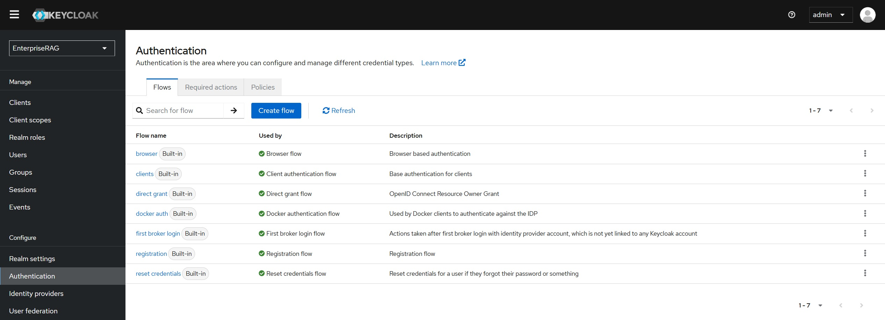
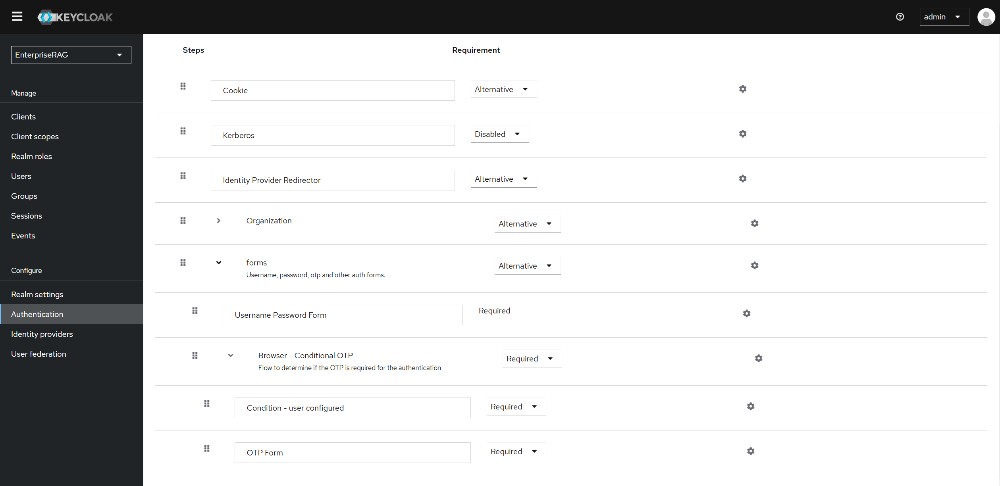
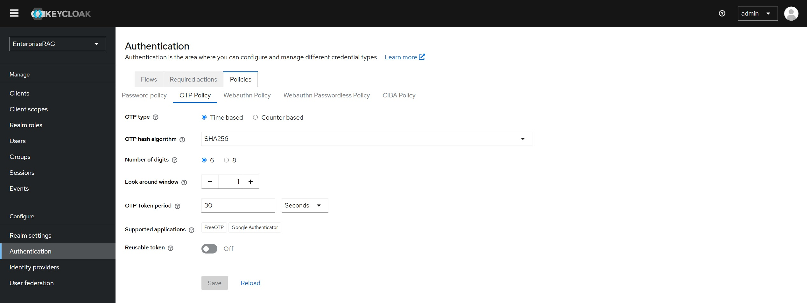
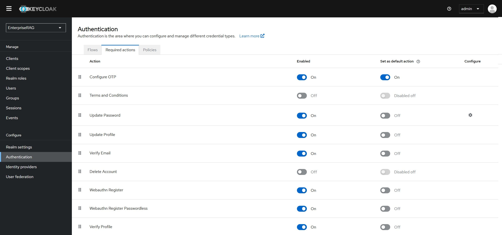
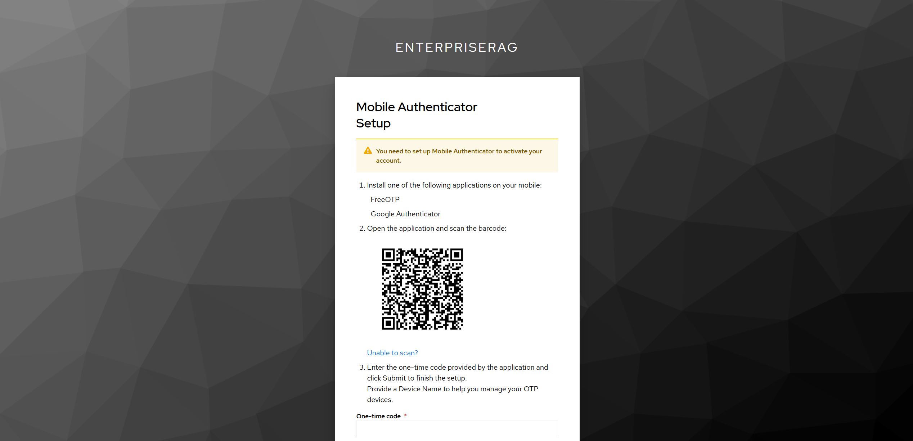

# Authentication Integration

[← Customize](../README.md#customize)

Intel® AI for Enterprise RAG supports multi-factor authentication and Microsoft Active Directory federation through Keycloak.

Configure this when users should sign in with their existing corporate accounts rather than the local accounts created at install time. It changes who can reach the UI and the API, so it is usually the step that turns an evaluation deployment into something you can hand to a wider group.

## Multi-factor authentication (MFA)

MFA using Google Authenticator can be enabled on an already-running deployment through the Keycloak admin console.

### Prerequisites

- Intel AI for Enterprise RAG deployed with Keycloak enabled
- Keycloak admin credentials (available in `env/<name>/logs/rag/default_credentials.txt` after install)

### Enable MFA

1. Log in to the Keycloak admin console at `https://keycloak.<base_domain_name>` (in `subdomain` routing mode) or `https://<base_domain_name>/auth` (in `path` routing mode) as `admin`.

2. Switch to the `EnterpriseRAG` realm.

3. Navigate to **Authentication → Flows**.

4. Select **Browser** from the Authentication Flows list.

5. Find the **Browser Conditional OTP** step in the flow tree. If not present, add it:
   - Click **Add Step**
   - Select **Conditional OTP Form**

6. Set **Browser Conditional OTP** and **OTP Form** to **REQUIRED**.

### Configure OTP policy

1. Navigate to **Authentication → Policies → OTP Policy**.

2. Configure:
   - **OTP Type:** TOTP (Time-based OTP)
   - **OTP Hash Algorithm:** SHA-256
   - **Number of Digits:** 6 (default)
   - **Look Ahead Window:** 1 (default)
   - **OTP Token Period:** 30 seconds (default)
   - **Supported Applications:** Ensure `Google Authenticator` is selected

3. Click **Save**.

### Enforce MFA for all users

1. Navigate to **Authentication → Required Actions**.

2. Click **Configure OTP** and set it to **Enabled**.

3. (Optional) Check **Default Action** to require all users to configure MFA at their next login.

4. Click **Save**.

Users will be prompted to set up an OTP device the next time they log in. Follow the on-screen instructions to link Google Authenticator, which will then generate 6-digit codes for each login.

## Related docs

| Topic | Link |
|-------|------|
| Single Sign-On with Microsoft Entra ID | [sharepoint.md](sharepoint.md) |
| Enterprise AI Solutions configuration | [`../../docs/customize/configuration.md`](https://github.com/intel/enterprise-ai-solutions/blob/main/docs/customize/configuration.md) |
