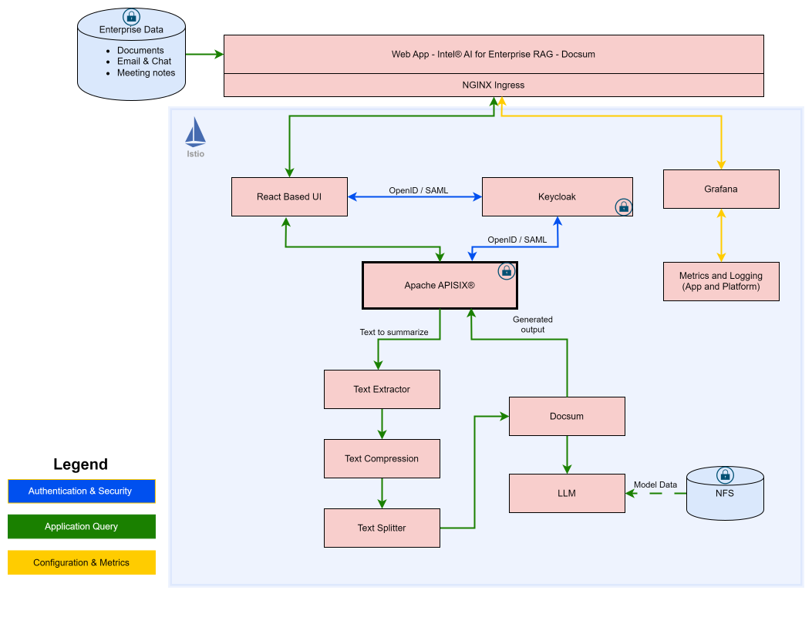

# Pipeline Configuration

[← Docs Index](../README.md)

The pipeline is what your deployment actually does. It decides whether users get conversational answers over your documents, one-shot summaries, translations, or voice, and which steps a question passes through on the way to an answer.

Picking a pipeline is therefore the first product decision, not a tuning detail: the flavour sets the use case, and the variant trades accuracy against latency, cost, and the number of model servers you have to fit on the machine. Intel AI for Enterprise RAG composes these service graphs from modular definitions, so switching is a configuration change and a re-install rather than a redeployment from scratch.

## Available pipelines

| Flavour | Pipeline Type | Description | Variants |
|---|---|---|---|
| `chatqna` | `chatqna` | Conversational RAG (default) | `base`, `query-rewrite`, `output_guard`, `retrieve-rerank`, `upload` |
| `docsum` | `docsum` | Document summarization | `base` |
| `translation` | `translation` | Language translation | `base` |
| `audioqna` | `chatqna` | ChatQnA + voice | `base` |
| `pl_chatqna` | `chatqna` | Polish-language RAG | `base` |

**Flavour:** name for `init erag --flavour <name>`; seeds `config.erag.yaml`. **Pipeline Type:** GMC service graph. **Variant:** graph modification; set via `pipeline_variant`.

## Pipeline variants

ChatQnA supports five variants:

| Variant | Changes | Use case |
|---|---|---|
| `base` (default) | None | Standard RAG |
| `query-rewrite` | Insert query rewrite before embedding | Ambiguous queries |
| `output_guard` | Insert output guard after LLM | Policy compliance |
| `retrieve-rerank` | Remove LLM/guardrails | Retrieval-only |
| `upload` | Remove all except embedding | Ingestion-only |

> [!NOTE]
> One pipeline runs at a time. Switching re-composes the graph and tears down the previous pipeline. The vector store lives in its own namespace and is preserved across the switch.

Set in `env/<name>/config.erag.yaml`:

```yaml
pipeline_type: "chatqna"
pipeline_variant: "query-rewrite"
```

Deploy: `./es_auto_installer.sh install erag --env <name>`.

## Pipeline architecture

**ChatQnA (base):** Embedding → Retriever → Reranking → PromptTemplate → LLMGuardInput → LLM. Models (llm-inference ns): `llama3-8b-awq`, `nomic-embed`, `bge-reranker`.

<div align="center">
   
</div>

**DocSum:** TextExtractor → TextCompression → TextSplitter → LLM → DocSum.

<div align="center">
   
</div>

**Translation:** LanguageDetection → PromptTemplate → LLM. Model: `alma-7b-r`.

The full microservice map for every pipeline is in the [Architecture reference](../reference/architecture.md#microservices).

## Variant details

| Variant | Flow | Model changes | Notes |
|---------|------|---------------|-------|
| **query-rewrite** | QueryRewrite → Embedding → ... → LLM | None (reuses chat LLM) | |
| **output_guard** | ... → LLM → **LLMGuardOutput** | None | Scans answers for policy violations |
| **retrieve-rerank** | Embedding → Retriever → Reranking | Remove LLM; keep embedding + reranking | Use case: retrieval-only, MCP gateway. |
| **upload** | Embedding only | Keep embedding only; remove LLM + reranking | No chat. UI shows "Chat Not Available". Re-allocates freed cores to embedding. |

**Switching to upload:**

```yaml
pipeline_variant: "upload"
inference_models:
  - name: nomic-embed
    role: embedding
mcp_enabled: false
```

Deploy: `./es_auto_installer.sh install erag --env <name>`. The install undeploys the dropped LLM and reranking model servers and re-places the embedding one at its upload size - no manual `./model-manager undeploy` step.

**Switching back to base:** restore the full model list, set `pipeline_variant: "base"`, re-enable `mcp_enabled` if it was on, re-install. The upload-sized embedding server is undeployed first (it takes the whole machine, so the LLM cannot be placed alongside it), then all three are deployed at base sizes. Weights stay on the `model-store` PVC, so nothing is re-downloaded.

## Switching pipelines

Edit `env/<name>/config.erag.yaml`:

```yaml
pipeline_type: "docsum"
pipeline_variant: "base"
```

Deploy: `./es_auto_installer.sh install erag --env <name>`. Tears down old pipeline, deploys new. Vector store preserved (separate namespace). Models may be replaced/re-sized.

## Configuration file structure

```yaml
pipeline_type: "chatqna"
pipeline_variant: "base"
inference_models:
  - name: llama3-8b-awq
    role: llm
  - name: nomic-embed
    role: embedding
  - name: bge-reranker
    role: reranking
# ui_chat_maintenance_mode: true   # auto-set for upload/retrieve-rerank; override if needed
```

## Best practices

| Practice | Rationale |
|----------|-----------|
| **Keep embedding model consistent** | Changing embedding changes vector dims; index not auto-rebuilt. Re-ingest all documents. |

> [!WARNING]
> Changing the embedding model invalidates the existing vector index. Retrieval will return nothing useful until every document is re-ingested. See [Models](../customize/models.md#what-changes-the-embedding-model).

**When to use variants:**

- **Query-rewrite:** ambiguous queries, domain terminology
- **Output_guard:** compliance, policy scanning
- **Retrieve-rerank:** retrieval-only, MCP with external LLM
- **Upload:** bulk ingestion, initial data load, re-indexing

## Related documentation

[Install RAG Guide](install_rag.md), [Configuration Reference](../customize/configuration.md), [Modular Pipelines Reference](../../deployment/pipelines/README.md).
