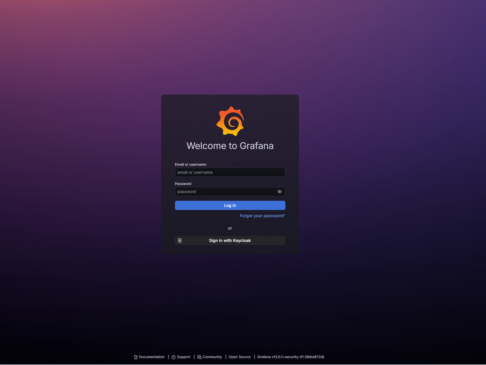
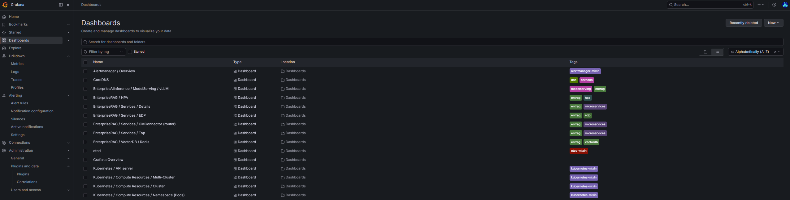
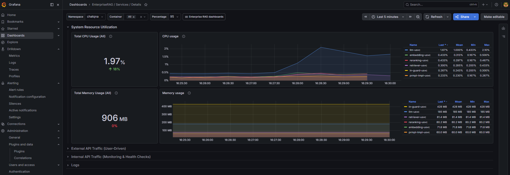
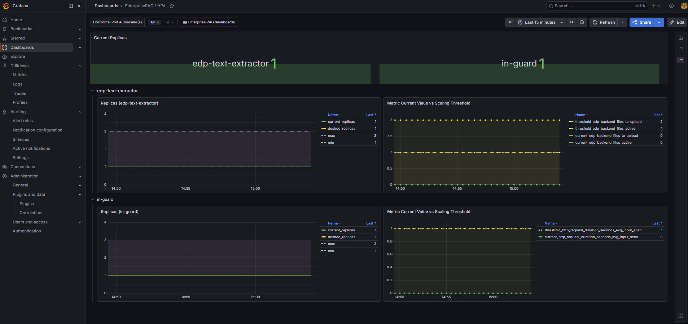
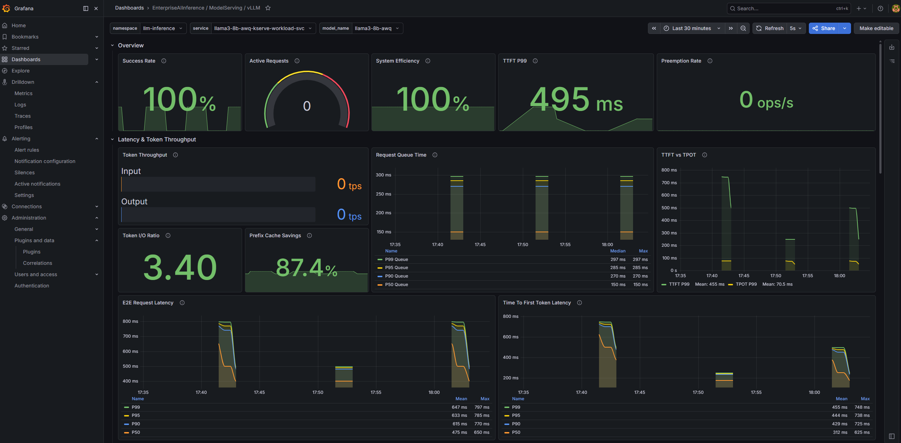
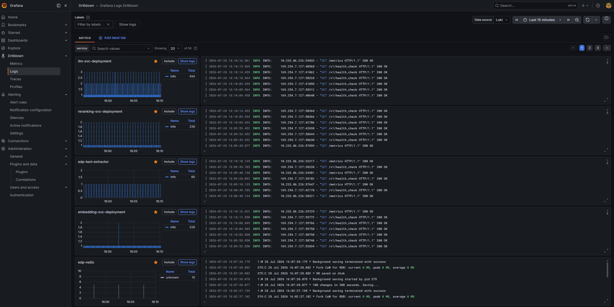

# Telemetry

Intel® AI for Enterprise RAG services emit metrics, logs, and traces to the platform observability stack (Prometheus + Grafana + Loki + Tempo). This doc covers accessing Grafana and the RAG-specific dashboards.

## Login

Visit `https://grafana.<base_domain_name>` (default: `https://grafana.solutions.ai`).



Two sign-in methods:

### Grafana admin credentials

Retrieve the admin password from the `grafana-admin-credentials` secret in the `monitoring` namespace:

```bash
kubectl get secret -n monitoring grafana-admin-credentials \
  -o jsonpath='{.data.password}' | base64 -d; echo
# Username: admin
```

### Keycloak SSO

On the Grafana login page, select **Sign in with Keycloak** and enter your username and password. Only users in the `erag-admins` or `erag-maintainers` Keycloak group can access Grafana.

## Dashboards

Click **Dashboards** in the left pane. Dashboards prefixed with `EnterpriseRAG` are tailored to Intel AI for Enterprise RAG services. The Grafana instance also provides standard Kubernetes, Node Exporter, and Prometheus Overview dashboards for cluster-level monitoring.



Eight dashboards ship with this layer, each provisioned by the component that owns it:

| Dashboard | Shipped by | Covers |
|---|---|---|
| `EnterpriseRAG / Services / Details` | `app_pipeline` (gmc chart) | Per-service resource use, API traffic, and logs |
| `EnterpriseRAG / Services / Top` | `app_pipeline` (gmc chart) | Cross-service summary of the busiest microservices |
| `EnterpriseRAG / Services / GMConnector (router)` | `app_pipeline` (gmc chart) | Pipeline router throughput and per-step timing |
| `EnterpriseRAG / Services / EDP` | `app_edp` | Ingestion counts, chunks, stages, and errors |
| `EnterpriseRAG / Services / Audio` | `app_audio` | ASR and TTS activity (AudioQnA flavour only) |
| `EnterpriseRAG / HPA` | `app_hpa` | Replica counts and scaling decisions |
| `EnterpriseRAG / VectorDB / Redis` | `app_vector_databases` | Redis vector store health and query load |
| `EnterpriseRAG / VectorDB / Microsoft SQL Server` | `app_vector_databases` | MSSQL vector store health and query load |

A dashboard only appears if its component is enabled, so the Audio and VectorDB dashboards depend on the flavour and the `vector_databases_vector_store` you chose.

The three most-used ones are described below.

### EnterpriseRAG / Services / Details

Overview of resource usage and service activity for selected namespace and services.



Key panels:
- **System Resource Utilization**: CPU and memory usage per service
- **External API Traffic**: User-facing requests (service, method, endpoint, request rate, P95 duration)
- **Internal API Traffic**: Monitoring and health-check requests (independent of user activity)
- **Logs**: Recent log entries filterable by namespace or service. For deeper log analysis use Grafana's **Explore -> Logs** feature in the left panel.

### EnterpriseRAG / Services / EDP

Metrics from the Enhanced Data Preparation (EDP) service: ingested documents, links, chunks, and processing statuses.


Key panels:
- **General**: Total ingested files and links, chunks, blocked documents (unsafe content), files in error state
- **Details**: Trends for files, links, and chunks over time
- **Errors and Logs**: Registered errors over time and recent logs
- **Stage Overview**: Items in each processing stage (embedding, input guard scanning, etc.)

See [EDP documentation](../../src/edp/README.md) for service details.

### EnterpriseRAG / HPA

Horizontal Pod Autoscaler activity: replica count, scaling actions over time, and the metrics used for scaling decisions (current value + threshold).



The top panel shows current replica count for each HPA-managed service. Below, each service has a section with replica changes over time and the scaling metric.

See [HPA configuration](../../deployment/components/hpa/README.md).

### Enterprise AI Inference Dashboards (tag `modelserving`)

Enterprise RAG relies on the **Enterprise AI Inference** component for LLM model serving. Models are served on vLLM or OpenVINO backends; Grafana provides dashboards for the backend in use. All AI Inference dashboards are tagged with `modelserving`, making them easy to find by filtering dashboards using that tag.



Example dashboard: `EnterpriseAIInference / ModelServing / vLLM`

Typical panels:
- **Request throughput and queue**: Incoming requests per second, in-flight requests, queue depth
- **Latency**: End-to-end request latency and time-to-first-token distributions
- **Token metrics**: Prompt and generation token counts and rates (useful for capacity planning)
- **Engine resource usage**: CPU and memory consumption of model-serving pods, correlated with traffic panels

## Logs

In the left panel, select **Explore -> Logs** to access Grafana's integrated log exploration feature. View, search, and filter logs with advanced filtering, real-time streaming, and contextual log inspection.



For more on using this feature see [Grafana Logs Drilldown documentation](https://grafana.com/docs/grafana-cloud/visualizations/simplified-exploration/logs/get-started/).

## Platform Telemetry

Grafana itself, Prometheus, Loki, and Tempo are deployed by the **platform layer** (`roles/observability/`). For login setup, data retention, and platform-level dashboards see the Enterprise AI Solutions observability documentation:

- [Enterprise AI Solutions documentation](https://github.com/intel/enterprise-ai-solutions/blob/main/docs/README.md)
