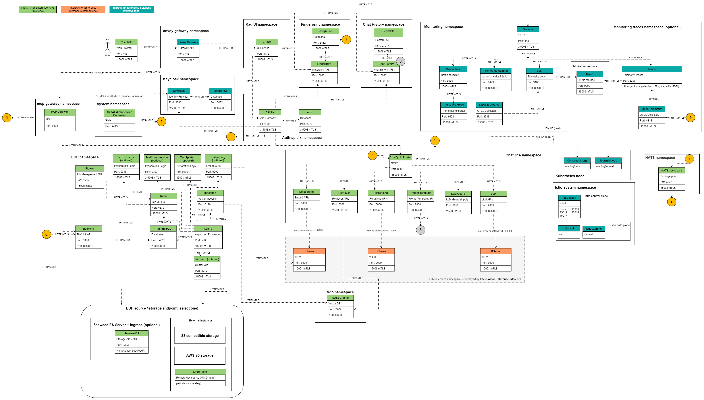

# Architecture

Intel® AI for Enterprise RAG is the application layer of the Intel® AI for Enterprise Solutions platform. It contributes a 15-component `erag` layer that deploys RAG pipelines, microservices, and UI onto the platform's Kubernetes, Istio mesh, PostgreSQL, and Keycloak/LiteLLM infrastructure.

This doc covers what the layer actually is, how its components compose into a working RAG application, and how it integrates with the inference and platform layers below it.

## Integration with Enterprise AI Solutions

Enterprise AI Solutions clones this repo into its own `ext/enterprise.ai-erag/` at runtime and auto-discovers its contributions:

| File | Purpose |
|------|---------|
| `deployment/components.yaml` | Registers 15 `app_*` components in the `erag` layer with dependency order |
| `deployment/pipelines/<flavour>/config.yaml` | Per-flavour baseline config, seeded to `env/<name>/config.erag.yaml` by `init erag --flavour <flavour>` |
| `deployment/roles/` | 21 Ansible roles (15 in the component registry + 6 helpers) |
| `deployment/components/` | Helm charts per component (apisix, audio, chat_history, edp, ferretdb, fingerprint, gmc, hpa, mcp_gateway, nats, postgresql, ui, utils, vector_databases) |
| `deployment/pipelines/` | 5 pipeline flavours: `chatqna`, `docsum`, `audioqna`, `translation`, `pl_chatqna` |

The installer adds `deployment/roles/` to `ANSIBLE_ROLES_PATH`, merges `components.yaml` into the component registry, and loads `config.erag.yaml` via `-e @...`.

### Commands

```bash
# Initialize a RAG environment (from Enterprise AI Solutions repo root)
./es_auto_installer.sh init erag --env myenv

# Install the erag layer (requires inference layer already installed)
./es_auto_installer.sh install erag --env myenv

# Check status
./es_auto_installer.sh status --env myenv
./es_auto_installer.sh validate erag --env myenv
```

## Layer Dependencies

The `erag` layer depends on `platform` and `inference`:

```
infrastructure  →  platform  →  inference  →  erag
                   (Istio,      (KServe,      (RAG app,
                    Keycloak,    vLLM,         pipelines,
                    CNPG,        Envoy AI      vector DB,
                    Envoy GW)    Gateway)      EDP, UI)
```

At install time Enterprise AI Solutions resolves these dependencies and deploys layers in order.

## Component Registry

15 components registered in `deployment/components.yaml`, executed in dependency order.

The **Enabled** column is the fallback in `components.yaml`, used only when nothing sets the toggle. Every shipped flavour's `config.yaml` turns on `vector_databases`, `chat_history`, `edp`, `ui`, `hpa` and `mcp`, so a default `init erag --flavour chatqna` deploys all of them. The fallback matters when you write your own config or explicitly disable a component.

| Component | Enabled (registry fallback) | Depends on | Purpose |
|-----------|-------------------|------------|---------|
| `app_inference_models` | Yes | - | Deploys LLM/embedding/reranking models via `model-manager`, waits for readiness |
| `app_pre_install` | Yes | `app_inference_models` | Creates namespaces, configures RBAC, provisions shared secrets |
| `app_vector_databases` | No (on in every flavour) | `app_pre_install` | Deploys Redis/MSSQL/pgvector vector store |
| `app_keycloak_config` | Yes (unless `keycloak_enabled=false`) | `app_pre_install` | Creates Keycloak realm, clients, role mappings for RAG services |
| `app_apisix` | Yes | `app_pre_install` | Deploys APISIX API gateway, provisions ClusterRole for ApisixRoute watchers |
| `app_chat_history` | No (on in every flavour) | `app_pre_install`, `app_apisix` | Chat conversation history service |
| `app_nats` | Yes | `app_pre_install` | NATS JetStream for GMC router state (NKey auth) |
| `app_fingerprint` | Yes | `app_pre_install`, `app_apisix`, `app_nats` | System fingerprint service for config integrity |
| `app_hpa` | Yes | `app_pre_install` | Horizontal Pod Autoscaler for pipeline microservices |
| `app_pipeline` | Yes | `app_pre_install`, `app_hpa`, `app_nats`, `app_fingerprint` | Composes and deploys the selected pipeline via GMC |
| `app_edp` | No (on in every flavour) | `app_vector_databases`, `app_apisix`, `app_hpa` | Enhanced Data Preparation (Celery + FastAPI + SQLAlchemy) |
| `app_mcp_gateway` | No (on in every flavour) | `app_edp`, `app_keycloak_config` | Model Context Protocol gateway (FastMCP) |
| `app_ui` | No (on in every flavour) | `app_pipeline`, `app_apisix` | React UI (chatqna / docsum / audioqna apps) |
| `app_watcher` | Yes | `app_pre_install` | Namespace status watcher for reboot recovery |
| `app_post_install` | Yes | - | Prints access URLs, credentials, validation summary |

**Helper roles** (included by other roles, not in the registry): `app_audio`, `app_check_pods`, `app_data_consistency`, `app_deployment_manifest`, `app_generate_password`, `app_password_mgmt`.

## Microservices

Each step of a RAG answer is its own service, which is what lets you swap a reranker, insert a query-rewrite step, or scale embedding independently of the LLM without touching anything else. The trade-off is more moving parts to understand, so the map and table below group them by the role they play.

21 FastAPI microservices in `src/comps/`, packaged as Docker images and deployed via Helm. That is 18 top-level services plus the three `guardrails` sub-services. `src/comps/cores/` and `src/comps/vectorstores/` are shared libraries the services import, not deployed services of their own.

<div align="center">
   
</div>

| Service | Purpose | Namespace (default) |
|---------|---------|---------------------|
| `asr` | Automatic speech recognition | `chatqna` (or pipeline-specific) |
| `chat_history` | Conversation history storage | `chatqna` |
| `docsum` | Document summarization | `docsum` |
| `embeddings` | Text embedding via model endpoint | `chatqna` |
| `guardrails` (3 variants) | Input/output/dataprep content filtering | `chatqna`, `edp` |
| `ingestion` | Document upload and storage | `edp` |
| `language_detection` | Language identification | `chatqna` |
| `late_chunking` | Late-chunking embedding strategy (not supported on the current model servers - see [Models](../customize/models.md)) | `chatqna` |
| `llms` | LLM request proxy | `chatqna` |
| `namespace_status_watcher` | Monitors namespace health | `default` |
| `prompt_template` | Prompt template rendering | `chatqna` |
| `query_rewrite` | Query rewriting for improved retrieval | `chatqna` |
| `reranks` | Reranking service | `chatqna` |
| `retrievers` | Vector/BM25 retrieval | `chatqna` |
| `system_fingerprint` | Config fingerprinting | `chatqna` |
| `text_compression` | Text compression | `chatqna` |
| `text_extractor` | Text extraction from docs | `edp` |
| `text_splitter` | Chunking service | `edp` |
| `tts` | Text-to-speech | `audioqna` |

Images built from `src/comps/*/impl/microservice/Dockerfile`, published to `docker.io/intel/enterprise-rag-<service>`. Default tag matches the solution version (`3.0.0`).

## GMC Operator

The GMC operator (`src/gmc/`) is a kubebuilder-based controller that composes microservices into a working pipeline. It defines the CRD `GMConnector` (API group `gmc.erag.intel.com`, version `v1alpha3`) with three router types:

| Router | Purpose | Example |
|--------|---------|---------|
| `Sequence` | Linear flow | `embedding → retriever → reranking → prompt-template → llm` |
| `Ensemble` | Parallel branches whose outputs are merged | Two retriever branches feeding one fusion step |
| `Switch` | Conditional routing | Supported by the operator; no shipped flavour uses it |

The router pod (`intel/enterprise-rag-gmcrouter`) sits at the pipeline's edge and dispatches requests step-by-step. The manager pod (`intel/enterprise-rag-gmcmanager`) reconciles `GMConnector` CRs and provisions step Services/Deployments/ConfigMaps.

## Pipeline Composition

Pipelines are modular definitions in `deployment/pipelines/<flavour>/`. Each flavour declares:

| File | Content |
|------|---------|
| `pipeline.yaml` | Metadata (`namespace`, `base_flow`, `endpoints`, `router`) |
| `config.yaml` | Flat override surface for this flavour (components enabled, models, resources) |
| `variants/` (optional) | Alternate flows: `query-rewrite`, `output_guard`, `retrieve-rerank`, `upload` |

Base step definitions live in `deployment/pipelines/_shared/steps/*.yaml.j2` (unified step + resources). A flavour may add a local `steps/` to override shared steps.

At install time `deployment/scripts/compose_pipeline.py` composes the selected pipeline + variant into a `GMConnector` CR written to `env/<name>/logs/rag/gmconnector-<pipeline>.yaml`, which `app_pipeline` applies.

### 5 Flavours

| Flavour | Namespace | Base flow | Router | Description |
|---------|-----------|-----------|--------|-------------|
| `chatqna` | `chatqna` | `embedding → retriever → reranking → prompt-template → llm-guard-input → llm` | `Sequence` | RAG question answering (default) |
| `docsum` | `docsum` | `text-extractor → text-compression → text-splitter → llm → docsum` | `Sequence` | Document summarization |
| `audioqna` | `chatqna` | Same as `chatqna` | `Sequence` | Thin flavour: ChatQnA graph plus `audio_enabled: true`. ASR and TTS are a runtime add-on in the `audio` namespace, not graph steps |
| `translation` | `translation` | `language-detection → prompt-template → llm` | `Sequence` | Translation, served by `alma-7b-r` |
| `pl_chatqna` | `chatqna` | Same as `chatqna` | `Sequence` | Thin flavour: ChatQnA graph plus `solution_language: pl` and a Polish LLM |

**Variants** (chatqna only): `output_guard`, `query-rewrite`, `retrieve-rerank`, `upload`.

Only one pipeline runs at a time. Switching requires changing `pipeline_type` and `pipeline_variant` in `config.erag.yaml` and re-running `install erag`.

## Enhanced Data Preparation (EDP)

EDP (`src/edp/`) is a FastAPI + Celery + SQLAlchemy pipeline for document ingestion and processing. It splits large uploads into async Celery tasks, chains ingestion → extraction → chunking → embedding → vector-store indexing, and persists job state in PostgreSQL.

| Component | Tech |
|-----------|------|
| API server | FastAPI |
| Task queue | Celery + Redis broker |
| Database | PostgreSQL (CNPG cluster) |
| Storage | SeaweedFS (default) / S3 / S3-compatible |

Endpoints: `/v1/dataprep` (upload), `/v1/dataprep/get_files`, `/v1/dataprep/delete_files`.

## UI

3 React 18 / TypeScript apps in `src/ui/apps/`, built with Vite + Tailwind + pnpm workspace:

| App | Purpose | Route |
|-----|---------|-------|
| `chatqna` | Conversational RAG UI | `https://erag-gateway.<domain>/` |
| `docsum` | Document summarization | `https://erag-gateway.<domain>/` |
| `audioqna` | Audio question answering | `https://erag-gateway.<domain>/` |

Each app is packaged as `docker.io/intel/enterprise-rag-<app>-ui` and deployed via the `ui` Helm chart. The UI hits the APISIX gateway, which routes to the GMC router service.

## MCP Gateway

The MCP gateway (`src/mcp_gateway/`) exposes Model Context Protocol endpoints backed by the RAG pipeline. Built with FastMCP, it proxies tool calls to the pipeline and returns structured responses.

Enabled via `mcp_enabled: true` in `config.erag.yaml`. Requires `app_edp` and `app_keycloak_config`.

## Namespaces

| Namespace | Owner | Purpose |
|-----------|-------|---------|
| `chatqna` (or flavour-specific) | This layer | Pipeline microservices, GMC router |
| `edp` | This layer | EDP API, Celery workers, PostgreSQL |
| `vdb` | This layer | Vector database (Redis/MSSQL/pgvector) |
| `llm-inference` | Inference layer | vLLM/OVMS model pods, KServe controller |
| `envoy-gateway-system` | Platform layer | Envoy Gateway, AI Gateway |
| `keycloak` | Platform layer | Keycloak |
| `monitoring` | Platform layer | Prometheus, Grafana, Loki, Tempo |

All RAG namespaces join the Istio ambient mesh via `istio.io/dataplane-mode: ambient` label.

## Istio Mesh Integration

The platform layer (`roles/istio/`) deploys Istio ambient mesh. RAG namespaces join the mesh by label; all inter-service traffic is mTLS-encrypted via ztunnel.

Current mTLS posture: `STRICT` via `PeerAuthentication` in each namespace. **Authorization policies are not currently deployed** - the deployment ships zero `AuthorizationPolicy` resources. Only mutual TLS is enforced; service-to-service authorization is not configured.

See [Mesh](mesh.md) for how to add a new service to the mesh.

## Storage

- **Vector database**: PVC (default 30Gi) for Redis/MSSQL persistence
- **EDP blob storage**: SeaweedFS (default) / S3 / S3-compatible object store
- **PostgreSQL**: CNPG-managed volumes (8Gi per cluster by default)
- **Model weights**: Inference layer's model-store PVC (shared across layers)
- **Backup and restore**: opt-in, Velero-based CSI volume snapshots of the namespaces above plus the
  identity realm — see [Backup and Restore](../operate/backup.md)

## Telemetry

Grafana dashboards tagged `EnterpriseRAG`:
- `EnterpriseRAG / Services / Details` - per-service CPU/memory, request rates, logs
- `EnterpriseRAG / Services / EDP` - ingestion stats, processing stages, errors
- `EnterpriseRAG / HPA` - autoscaler activity and thresholds

Additionally, inference layer dashboards (`modelserving` tag) show vLLM/KServe metrics.

Logs flow to Loki via OpenTelemetry; traces go to Tempo. Access via `https://grafana.<base_domain_name>`.

See [Telemetry](../operate/telemetry.md) for login and dashboard details.

## Deployment Sequence

At `install erag`:

1. **app_inference_models**: Deploys embedding, reranking, LLM models via `model-manager`, waits for `Ready`
2. **app_pre_install**: Creates namespaces, RBAC, secrets, labels namespaces for Istio
3. **app_vector_databases** (if enabled): Deploys Redis cluster / MSSQL / pgvector
4. **app_keycloak_config** (if enabled): Creates RAG realm, clients, groups in Keycloak
5. **app_apisix**: Deploys APISIX gateway, provisions ClusterRole for watchers
6. **app_nats**: Deploys NATS JetStream with NKey auth
7. **app_fingerprint**: Deploys fingerprint service
8. **app_hpa** (if enabled): Applies HPA resources
9. **app_pipeline**: Composes GMConnector CR, deploys GMC operator + router + step services
10. **app_edp** (if enabled): Deploys EDP API, Celery, PostgreSQL
11. **app_mcp_gateway** (if enabled): Deploys MCP gateway
12. **app_ui** (if enabled): Deploys React UI
13. **app_watcher**: Deploys namespace status watcher
14. **app_post_install**: Prints access URLs and credentials

## Related

- [Telemetry](../operate/telemetry.md) - Grafana dashboards, log queries
- [Performance](../operate/performance.md) - Tuning model sizing, HPA, Redis vector index settings
- [Docker Images](docker_images.md) - Published images and Dockerfiles
- [Mesh](mesh.md) - Istio integration and mTLS posture
